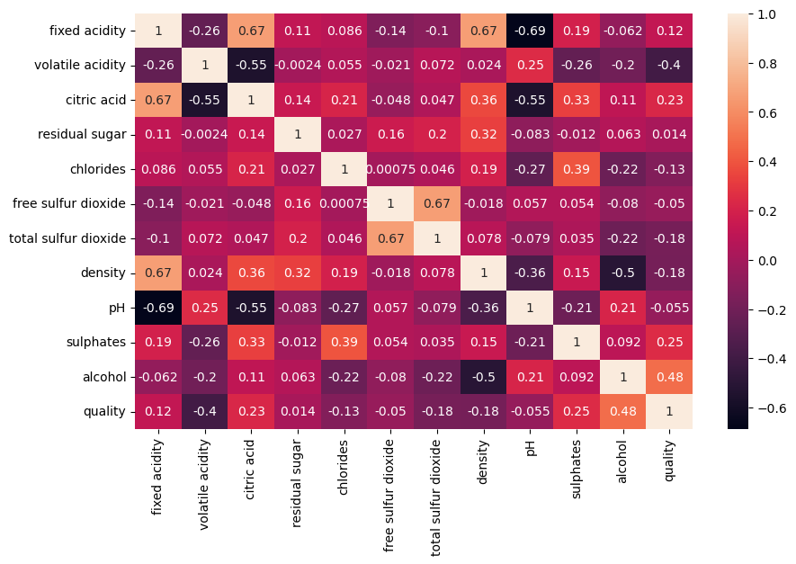
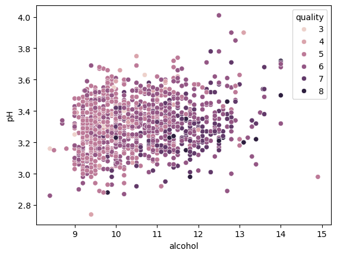
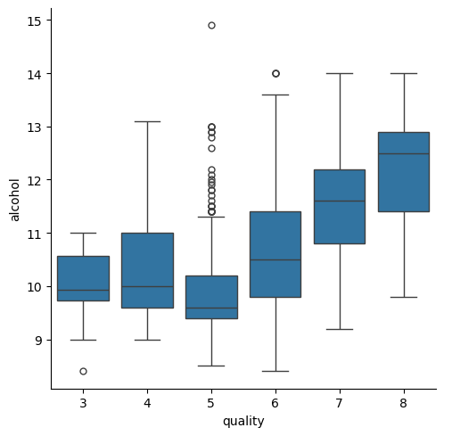
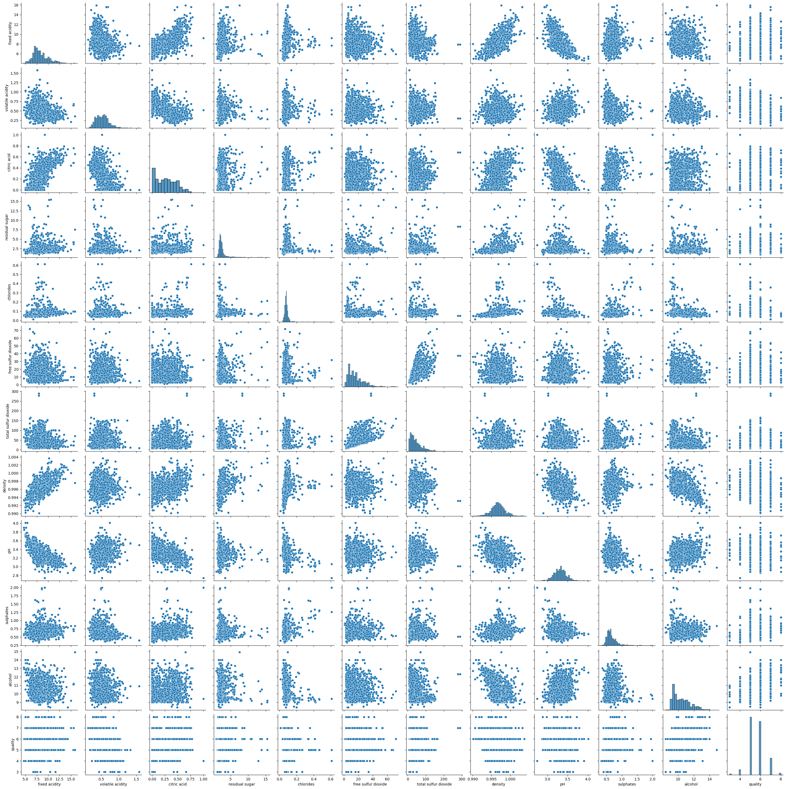

# Wine Quality EDA Analysis

## Project Summary

This project demonstrates an end-to-end Exploratory Data Analysis (EDA) workflow using Python to investigate the factors influencing wine quality ratings. The analysis focuses on data quality assessment, feature relationships, statistical exploration, and insight generation through visualization techniques.

As part of my professional upskilling journey in Data Analytics, I completed this project to strengthen practical skills in data cleaning, exploratory analysis, and business-focused storytelling with data.

Tools Used:
- Python
- Pandas
- NumPy
- Matplotlib
- Seaborn
- Jupyter Notebook

## Overview

The objective of this project is to analyze a wine quality dataset and derive meaningful insights through Exploratory Data Analysis (EDA) and data visualization techniques.

The analysis focuses on:

- Understanding data structure
- Assessing data quality
- Detecting duplicate records
- Exploring feature relationships
- Identifying variables influencing wine quality
- Creating visualizations for pattern discovery

This project demonstrates a typical data analytics workflow used in business and data science environments.

## Learning Context

This project was completed as part of a hands-on Udemy Data Science and Data Analytics course.

While following the guided curriculum, I independently performed data profiling, cleaning, visualization, and exploratory analysis to strengthen my practical understanding of Python-based analytics workflows.

The repository forms part of my professional upskilling journey as I continue building expertise in Data Analytics, Business Intelligence, and Data Visualization.

## Repository Structure

├── data/
│   └── winequality-red.csv
│
├── Wine_Quality_Eda.ipynb 
│
├── images/
│   ├── 1_correlation_heatmap.png
│   ├── 2_wine_quality_count.png
│   ├── 3_pairplot.png
│   ├── 4_quality_alcohol_boxpllot.png
│   ├── 5_alcohol_ph_scatter.png
│
├── README.md
└── requirements.txt

## Dataset

Source: UCI Machine Learning Repository

The dataset contains physicochemical properties of Portuguese red wine samples along with quality ratings.

Example features include:

- Fixed Acidity
- Volatile Acidity
- Citric Acid
- Residual Sugar
- Chlorides
- Sulphates
- Alcohol
- pH
- Density
- Quality Score

## Analysis Performed

### Data Profiling

- Dataset structure review
- Data type validation
- Statistical summary generation

### Data Quality Assessment

- Missing value detection
- Duplicate record identification
- Duplicate removal

### Correlation Analysis

- Correlation matrix generation
    - 
- Heatmap visualization
- Feature relationship analysis

### Univariate Analysis

- Distribution plots
- Histograms
- Quality score frequency analysis

### Bivariate Analysis

- Scatterplots
  - 
- Boxplots
  - 
- Feature-to-quality comparisons

### Multivariate Analysis

- Pairplots
  - 
- Interaction analysis between multiple variables

## Key Insights

- Wine quality ratings are concentrated around scores of 5 and 6, indicating an imbalanced target distribution.
- Alcohol content shows a positive relationship with wine quality, suggesting it may be an important predictive feature.
- Volatile acidity demonstrates a negative relationship with quality ratings.
- Several physicochemical attributes exhibit strong inter-correlations, highlighting potential multicollinearity considerations for future modeling.
- Data visualization enabled the identification of patterns that can inform feature selection for predictive analytics.

## Skills Demonstrated

- Exploratory Data Analysis (EDA)
- Data Cleaning
- Data Validation
- Statistical Analysis
- Data Visualization
- Correlation Analysis
- Business Insight Generation
- Python Programming
- Pandas
- Seaborn
- Matplotlib

## Future Enhancements

- Build Wine Quality Prediction Models
- Feature Selection Techniques
- Classification Algorithms
- Model Evaluation and Comparison
- Dashboard Development using Power BI
